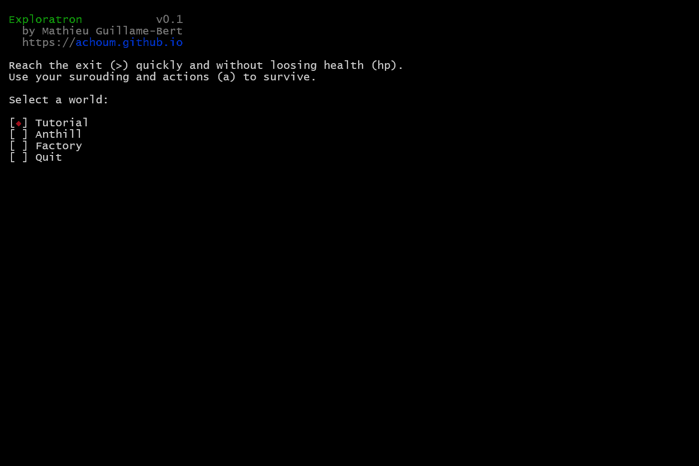
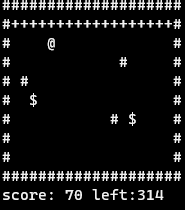

# Exploratron

**Exploration** is a open-source turn-by-turn sandbox puzzle game with multiple simple mechanics that interact with each other and create complex and interesting emergent gameplay situations.



Precompiled releases are available in:

- [Web browser]()
- [Windows]()
- [Linux]()

## Compilation from source

Requires *Bazel*.

On Web browser: 

```shell
./tools/game_wasm.sh
```

On Linux: 

```shell
./tools/game_terminal.sh
```

On Windows: 

```shell
tools\game_terminal.bat
```

## Map creation

Maps are created using [Tiled](https://www.mapeditor.org/download.html). See examples in the `exploratron\assets\map` directory.

## Agent training

Exploratron is also a framework to train and evaluate agent using Machine Learning.



Read, modify and and run `./tools/train_agent.sh` to train and evaluate agents.

Some examples of commands (see `./tools/train_agent.sh` for details):

```shell

LOGDIR=$(pwd)/training_logs

FLAG="--config=linux --define=terminal=linux_console"

# MODE="-c dbg"
MODE="-c opt"

# Run the evaluation on the "Gather" area using the Random controler (no leaning).
bazel run $MODE --config=linux --define=terminal=linux_console //exploratron/cli:evaluate_main $FLAG -- \
    --arena=Gather --controller_key=Random --num_repetitions=100

# Train and evaluate a genetic controller on the "Gather" area.
# Hyper-parameters are available in `exploratron/controller/genetic/genetic.h`
bazel run $MODE --config=linux //exploratron/controller/genetic:train_main $FLAG -- \
    --training_log_base=${LOGDIR}/gather/genetic/r1_

# Train and evaluate a hill climbing controller on the "Gather" area.
# Hyper-parameters are available in `exploratron/controller/hill_climb/hill_climb.h`
bazel run $MODE --config=linux //exploratron/controller/hill_climbing:train_main $FLAG -- \
    --training_log_base=${LOGDIR}/gather/hill_climb/r1_

# Run the evaluation on the "Gather" area using the keyboard controler (no leaning).
bazel run $MODE --config=linux //exploratron/cli:evaluate_main $FLAG -- \
    --arena=Gather --controller_key=Keyboard
```

Results can be compared using the R scipe `./tools/plot_training_logs.R`.
